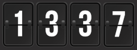
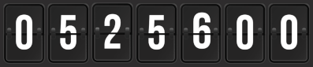
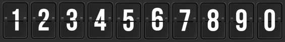
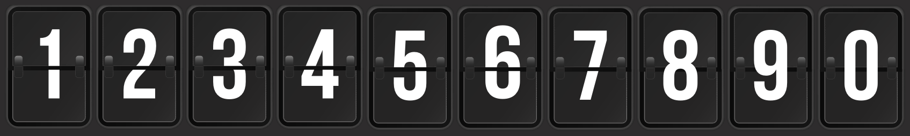

= Classic Hit Counter

*Add a fancy visitor counter to your website - _now with analytics!_*

image::docs/13370_blue_digital_small.png[13370_blue_digital_small,align="center"]

== Overview and Resources

I created this as a simple experiment to work with the Deno ecosystem.  In
particular, I wanted to see how the Deno commands (fmt, lint, compile, etc.) and
JSR felt as developer tools.  This project spun off several (moderately) useful
tools:

* https://jsr.io/@funnylookinhat/base62[Base62: Encode and Decode]
* https://jsr.io/@funnylookinhat/logosaurus[Logosaurus: Simple Logging Tool]
* https://github.com/funnylookinhat/action-deno-conventional-release[Github Action - Deno Conventional Release]

I also took this opportunity to work with https://GHCR.io[GHCR.io] as a
container registry and connecting a repository to
https://docs.github.com/en/packages/learn-github-packages/introduction-to-github-packages[Github Packages].

You can find some useful Github Actions for releasing Deno projects here:

* link:.github/workflows/generate-release.yml[Action: Generate Release Workflow]
** Uses the above referenced workflow to generate a release on every merge to
   main.
* link:.github/workflows/build-image.yml[Action: Build Image on Release]
** Upon successful completion of the release workflow, builds and pushes an
   image to GHCR.
* link:.github/workflows/pull-request-ci.yml[Action: Pull Request Continuous Integration]

Ultimately, the real value of this project was all of the ancillary things that
were created.  I'll be referencing most of these workflows (and the logging
tool) in future Deno projects.

== Project Features

* Generates a counter image in a configurable style.
* Images are generated in a configurable number of workers.
* Tracks "visitors" by IP per site, page, or hit.
* Optionally only count traffic from accepted domains (Configurable via ENV).
* Basic statistics are available at /stats.json

== Installation and Configuration

=== Run with Docker

Docker images are published to GHCR: https://github.com/funnylookinhat/classic-hit-counter/pkgs/container/classic-hit-counter[Docker Containers]

Example `docker-compose.yml` file:

[source,yml]
----
version: '3'

services:
  classic-hit-counter:
    image: ghcr.io/funnylookinhat/classic-hit-counter:latest
    container_name: classic-hit-counter
    ports:
      - "8000:8000"
    environment:
      PORT: 8000
      COUNTER_STYLE: "blue_digital_small"
      SITE_DOMAIN: "your-site.com"
      REQUIRE_SITE_DOMAIN: "ENABLED"
      DATA_DIR: "/data"
      IP_HEADER: "x-forwarded-for"
      MAX_IP_TRACKING: 10000
      MINIMUM_IMAGE_DIGITS: 10
      IMAGE_WORKERS: 2
      LOG_LEVEL: "info"
    volumes:
      # Be sure to map a directory that won't be destroyed.
      # This is used to store site data between restarts.
      - ./data:/data
----

=== Configuration

The following configuration options are available via environment variables:

* `PORT` (default: 8000) - The port on which the server will run.
* `COUNTER_STYLE` (default: "blue_digital_small") - The style of the counter
  image. Available options are "blue_digital_small", "blue_digital_large",
  "analog_small", and "analog_large".
* `DEV_MODE` (default: false) - Enable or disable development mode. This is
  mostly used to enable the `html/test-*` files for testing.
* `SITE_DOMAIN` (default: "localhost") - The domain of the site to be tracked.
* `REQUIRE_SITE_DOMAIN` (default: false) - If enabled, only count traffic from accepted domains.
* `DATA_DIR` (default: "") - The directory where site data will be stored.
* `IP_HEADER` (default: "x-forwarded-for") - The header used to track visitor IPs.
* `MAX_IP_TRACKING` (default: 10000) - The maximum number of IPs to track.
* `MINIMUM_IMAGE_DIGITS` (default: 10) - The minimum number of digits in the counter image.
* `IMAGE_WORKERS` (default: 1) - The number of workers to use for generating images.
* `LOG_LEVEL` (default: "info") - The minimum log level for logging. Available
  options are "trace", "debug", "info", "warn", "error", "fatal".

=== Counter Styles

There are currently 4 styles.  Pull requests for more styles welcome!

Quite a few counters can be sliced and referenced (with attribution) on this
site: https://www.freepik.com/free-photos-vectors/number

==== analog_small

==== analog_large

==== blue_digital_small

image::docs/1234567890_blue_digital_small.png[1234567890_blue_digital_small,align="center"]

==== blue_digital_large

